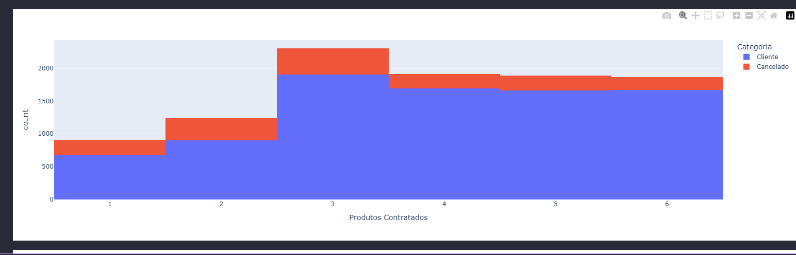

## 📊 Análise de Dados em Python

## 📌 Descrição
Projeto de análise de dados utilizando Python para leitura e processamento de arquivos CSV, com geração de insights básicos a partir dos dados.

---

## ⚙️ Tecnologias
- Python  
- Pandas  
- Matplotlib (opcional)

---

## 🚀 Como executar
```bash
git clone https://github.com/leitep955-del/projeto_analise_dados.git
cd projeto_analise_dados
pip install pandas matplotlib
python main.py
```

---

## 📊 Resultado



O gráfico mostra a relação entre a quantidade de produtos contratados e o número de clientes e cancelamentos. É possível observar que, conforme aumenta a quantidade de produtos, o número de clientes cresce e os cancelamentos se mantêm relativamente menores, indicando maior retenção.

---
## 📁 Estrutura
projeto_analise_dados/
├── main.py
├── dados.csv
├── grafico.png
└── README.md

---

## 👤 Autor

Pedro Leite
🔗 https://github.com/leitep955-del
